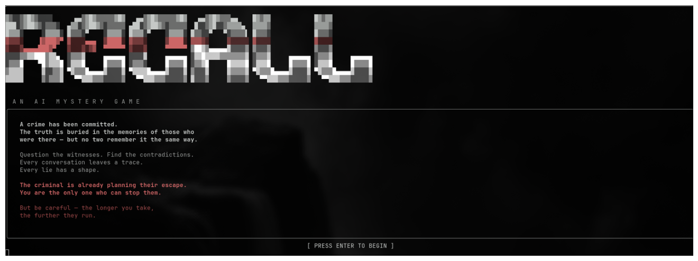
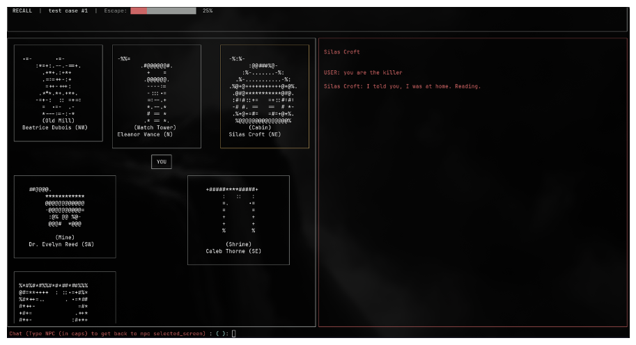

# Recall

#### An AI-driven murder mystery terminal game where every run creates a new story, suspects, killer, and conversations.

#### Players investigate by talking to NPCs. NPCs remember previous conversations, react dynamically, and provide clues based on the generated mystery.




## Features

- AI-generated murder mystery stories
- Dynamic NPC personalities and conversations
- Persistent NPC memory system
- Procedurally selected killer and clues
- Terminal-based interactive UI
- Local (ollama) and cloud (Gemini) LLM support 

## How It Works

1. A new world and murder mystery are generated.
2. NPCs are created with unique personalities and knowledge.
3. Players interrogate NPCs.
4. Conversations are stored in memory.
5. Player uses gathered information to accuse the killer.

## Setup

**The game might break on Windows so set up a Docker container for Linux or maybe use a Mac.**

### Clone

1. 
` git clone git@github.com:lightsigma96/Recall.git ` 

OR

` git clone https://github.com/lightsigma96/Recall.git `

2. cd Recall

### Install

Use a virtual environment to avoid clashing with your system packages and get packages with versions I used.

Set up a virtual environment with : ` python3 -m venv .venv `

Activate virtual environment with : ` source .venv/bin/activate `

Install using: ` pip install -r requirements.txt ` or ` python3 -m pip install -r requirements.txt `

### Setting Up Cloud and Local Model for Game

Game uses hybrid approach of Local and Cloud Model by default, this was done to generate story using Cloud Model (offloading heavy task) and Local Model for NPCs (light task).

Create a .env file exactly like this:
```
##### CLOUD MODEL API KEY

export COGNEE_API_KEY = "your_cognee_cloud_api_key"
export GEMINI_API_KEY="your_gemini_cloud_api_key"

##### LLM — Ollama
export LLM_MODEL="gemma3:4b" # Can change according to need

##### Embeddings — Ollama (Needed when running cognee locally)
EMBEDDING_PROVIDER="ollama"
EMBEDDING_MODEL="nomic-embed-text:latest"
EMBEDDING_ENDPOINT="http://localhost:11434/api/embed"
EMBEDDING_DIMENSIONS="768"
HUGGINGFACE_TOKENIZER="nomic-ai/nomic-embed-text-v1.5"
```
## Tech Stack

- Python
- Rich (terminal UI)
- Cognee (memory)
- Cloud Model for Story Generation
- Ollama/local models for NPCs

## Limitations

- Local models need enough RAM/VRAM
- Story quality depends on model capability
- Fallbacks to Hardcoded Story if fails to load Cloud Model.

## Future Ideas

- Whisper Feature (some code can already be seen in memory_management.py for this feature)
- More Levels
- More NPC behaviors
- Bigger worlds
